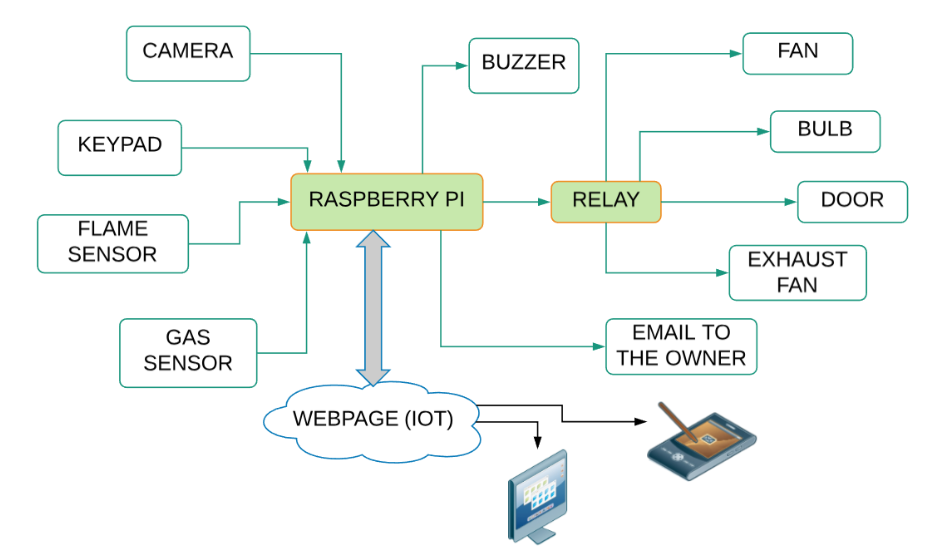
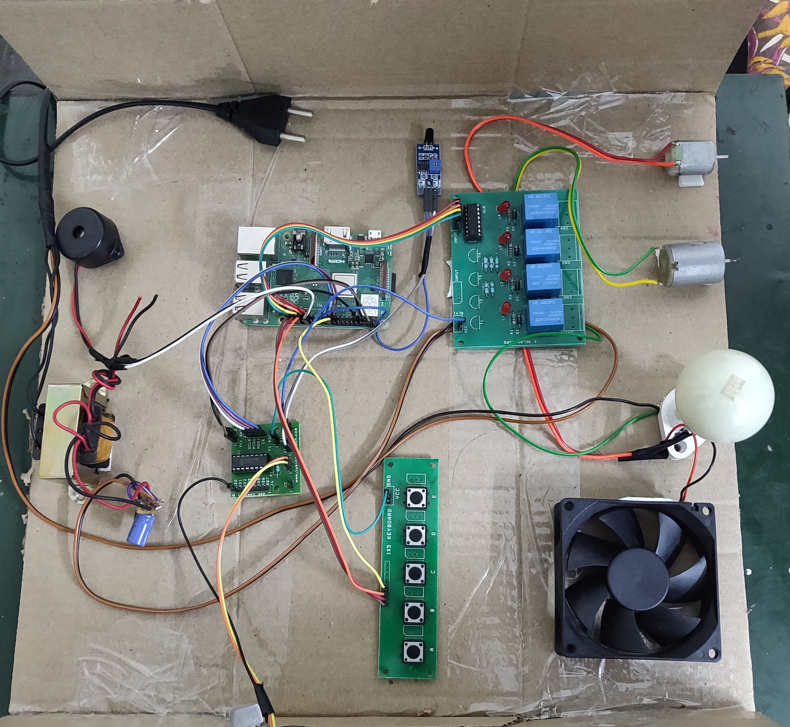
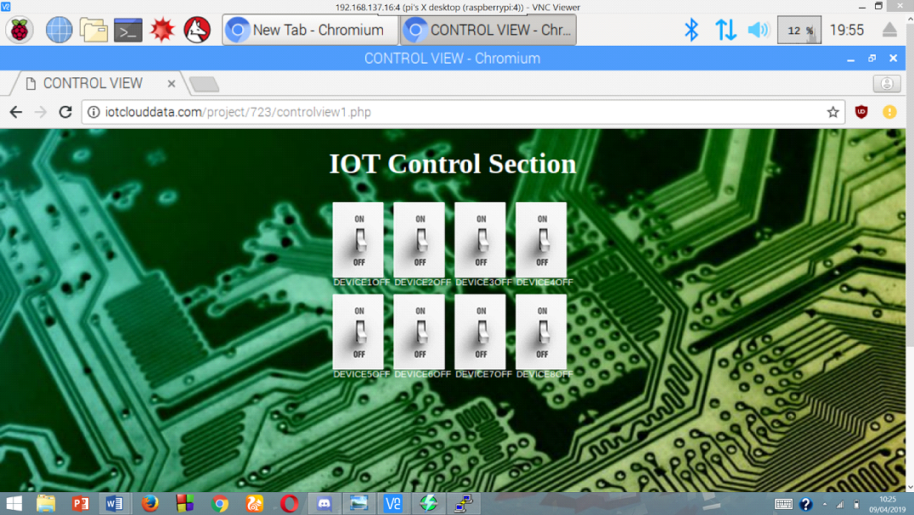
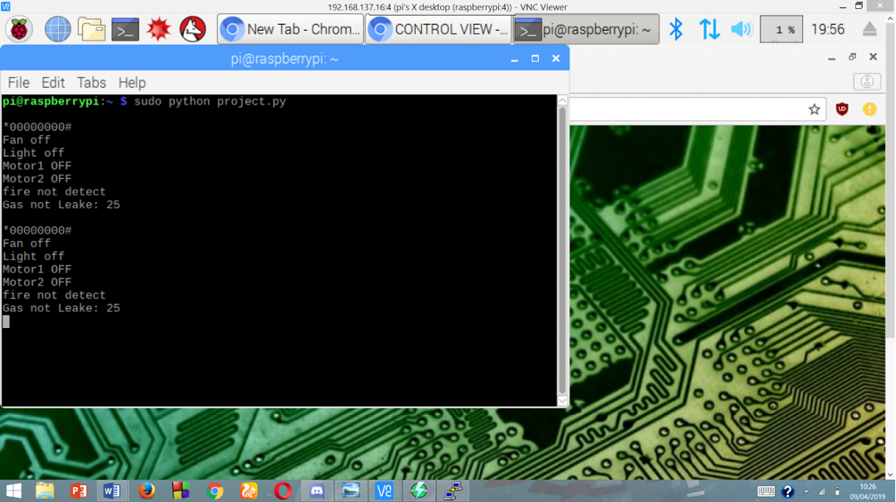

# IOT-Based-Smart-Home-System

B. Tech. ECE Final Year Project (2019)

## Summary

Designed and implemented a Smart Home System for disabled persons 
using Raspberry Pi and IoT. The general plan of Smart Home System (SHS) actualizes an ease and
low cost remote wireless interaction between a Raspberry Pi module and a web page to control
various appliances present at home along with a door security system. It provides a combination of
three components - door security, sensor security and ease of lifestyle especially for disabled
people. Safety is a primary worry in everyone’s day to day lives and digital locks have become an
integral part of these security systems. A digital lock is something which could not be tampered
easily, can capture an image in case of passkey being entered wrong thrice & is capable of sending
it to the owner via E-mail. Smart home system with sensor security can be used to monitor 
environment to ensure safety and alert people when there is likely to be a dangerous situation.
Hence a weblink controlled home system with security sensors eases their lives and takes away 
their misery. Hence it will be very useful for elderly/disabled people who are very important 
segment of life as they can easily control various appliances without much physical effort along 
with enhanced security.

## Block Diagram

## Hardware Setup

## Webpage Control System

## Debug Prints on Terminal

